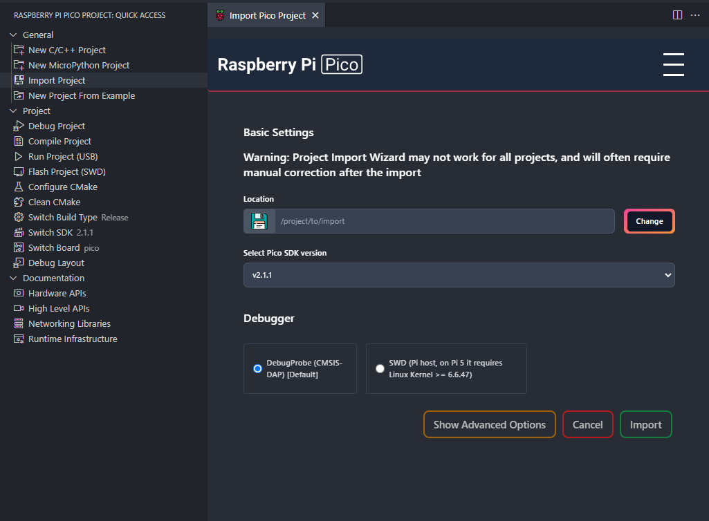

# PicoVescUart

This is an Raspberry Pi Pico specific implementation of the
[bldc](http://vedder.se/2015/10/communicating-with-the-vesc-using-uart/) interface,
which is a programmatical interface for the VESC motor controller.

## Dev Setup

### Customizing for your use case.

To use this library, you must first clone the repository locally,

```
git clone https://github.com/asap-lo/PicoVescUart.git
```

or pull in as a submodule, if you don't want to store the files in your repository.

```
git submodule add https://github.com/asap-lo/PicoVescUart.git
git submodule update --init --recursive
```

This library is built using CMake, and can be integrated into an existing project or used to create a new project.

### Creating a New Project:

First, you need to edit the CMakeLists.txt file in the repository root.

```cmake
################################################################
# Edit the following three lines to fit your specific use case #
################################################################

# https://github.com/raspberrypi/pico-sdk/blob/ee68c78d0afae2b69c03ae1a72bf5cc267a2d94c/README.md?plain=1#L187-L192
set(PICO_BOARD pico CACHE STRING "Board type")

# Change `Example` to whatever your project/filename is called,
# or feel free to leave it as example. Just add what you need.
project(Example C CXX ASM)
add_executable(${CMAKE_PROJECT_NAME} ${CMAKE_PROJECT_NAME}.c)
```

The `PICO_BOARD` line is important if you are using a different board than the standard `pico` board. 
A list of boards can be found [here](https://github.com/raspberrypi/pico-sdk/blob/ee68c78d0afae2b69c03ae1a72bf5cc267a2d94c/README.md?plain=1#L187-L192)
(linked above, also).

You do not need to change the `project` or `add_executable` lines if you just want to
write your code in the `Example.c` file, but if you want a different file name, simply
change the name `Example` in the `project` line to whatever you want, and it should
automatically pick up the filename.

### Integrating Into an Existing CMake Project

This is by no means a comprehensive guide. It would be helpful to understand CMake, as
you may have to figure out some things for yourself. For example, if you already have
the pico-sdk in your project, you may need to delete the import and init from the
CMakeLists.txt file in this repository.

Nevertheless, here are some instructions for a very basic project:

1. Remove these lines from the repository-root-level CMakeLists.txt:

	```cmake
	project(Example C CXX ASM)
	add_executable(${CMAKE_PROJECT_NAME} ${CMAKE_PROJECT_NAME}.c)
	```

1. In your project's CMakeLists.txt file, which should contain the `PicoVescUart`
	directory, add the following line:

	```cmake
	add_subdirectory(PicoVescUart)
	```

	YOU MUST PLACE THIS LINE AFTER YOU DEFINE YOUR PROJECT IN A `project()` CALL, AND YOU
	CALL `add_executable()`


### Using the Raspberry Pi Pico VS Code Extension

This is the easiest way to deploy your code to the Pico. All you need to do is import
this folder using the `Import Project` wizard.

Make sure you input the path to the repository root into the `Location` parameter, e.g
`/home/joe/PicoVescUart`.




### Platform Specific Dependencies

#### Windows (10)

Download the [Windows installer](https://www.raspberrypi.com/news/raspberry-pi-pico-windows-installer/)
to get all dependencies needed for the Pico.

#### Linux (Ubuntu)

```
sudo apt update
sudo apt install cmake python3 build-essential gcc-arm-none-eabi \
	libnewlib-arm-none-eabi libstdc++-arm-none-eabi-newlib
```

#### MacOS (Sonoma 14.1.2)

Requires [Homebrew](https://brew.sh)

```sh
brew install arm-none-eabi-gcc cmake picotool 
```

## Build Instructions

### First time setup

Open a terminal in the repository root, and run the following commands:

```sh
mkdir build
cd build
cmake ..
```

### Building Software

After above setup, you should be able to run `make` within the build directory, and
your executable will be built.

## Initializing

Below is a small guide on how to initialize this interface in your own code.

Use the following recipes in some `*.c` file in the repository root:

### Initializing without callback function

```c
#include "PicoVescUart.h"

int main() {
    comm_uart_init(NULL);

    // Your application main loop/other code here!
}
```

### Initializing with packet receive callback function

This function is called by the `bldc_interface` on every packet receipt. This is not a
requirement, but will likely be useful in many cases for handling data coming from the
motor controller.

Make your callback function like this:

```c
#include "PicoVescUart.h"

void on_value_received(mc_values *val)
{
    current_data_values = *val;
    
    // Handle values here! See struct below.
}

int main() {
    comm_uart_init(on_value_received); // pass function as a parameter. 

    // Your application main loop/other code here!
}
```

<details>
  <summary>mc_values struct from vesc/datatypes.h</summary>

```c
typedef struct {
	float v_in;
	float temp_mos;
	float temp_motor;
	float current_motor;
	float current_in;
	float id;
	float iq;
	float rpm;
	float duty_now;
	float amp_hours;
	float amp_hours_charged;
	float watt_hours;
	float watt_hours_charged;
	int tachometer;
	int tachometer_abs;
	mc_fault_code fault_code;
	float pid_pos;
	uint8_t vesc_id;
} mc_values;
```

</details>

## Usage

There are also many getter and setter methods, which are listed below and in
`(vesc/bldc_interface.h)`

### Getters

From `(vesc/bldc_interface.h)`

```c
// Getters
void bldc_interface_get_fw_version(void);
void bldc_interface_get_values(void);
void bldc_interface_get_mcconf(void);
void bldc_interface_get_appconf(void);
void bldc_interface_get_decoded_ppm(void);
void bldc_interface_get_decoded_adc(void);
void bldc_interface_get_decoded_chuk(void);
```

### Setters

From `(vesc/bldc_interface.h)`

```c
// Setters
void bldc_interface_terminal_cmd(char* cmd);
void bldc_interface_set_duty_cycle(float dutyCycle);
void bldc_interface_set_current(float current);
void bldc_interface_set_current_brake(float current);
void bldc_interface_set_rpm(int rpm);
void bldc_interface_set_pos(float pos);
void bldc_interface_set_handbrake(float current);
void bldc_interface_set_servo_pos(float pos);
void bldc_interface_set_mcconf(const mc_configuration *mcconf);
void bldc_interface_set_appconf(const app_configuration *appconf);
```
